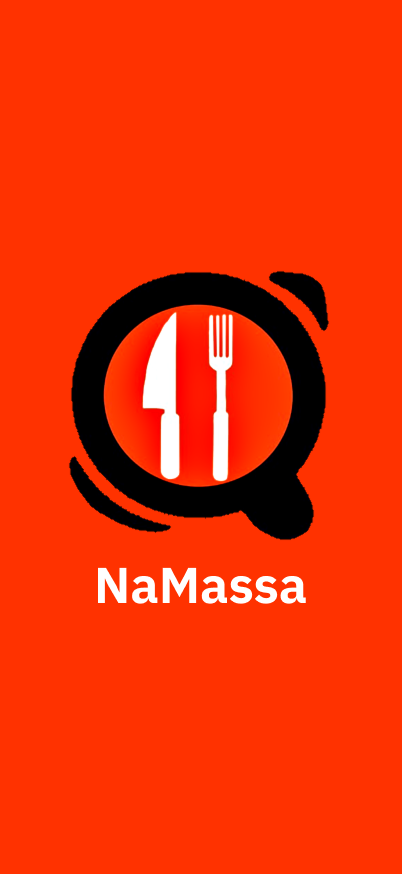
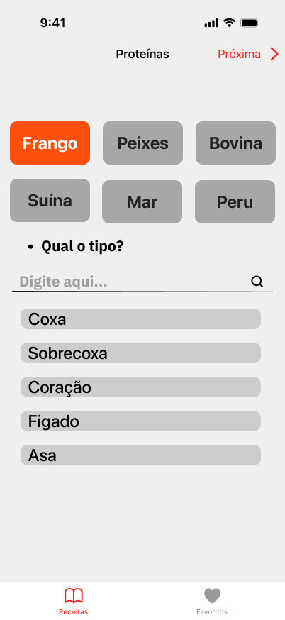
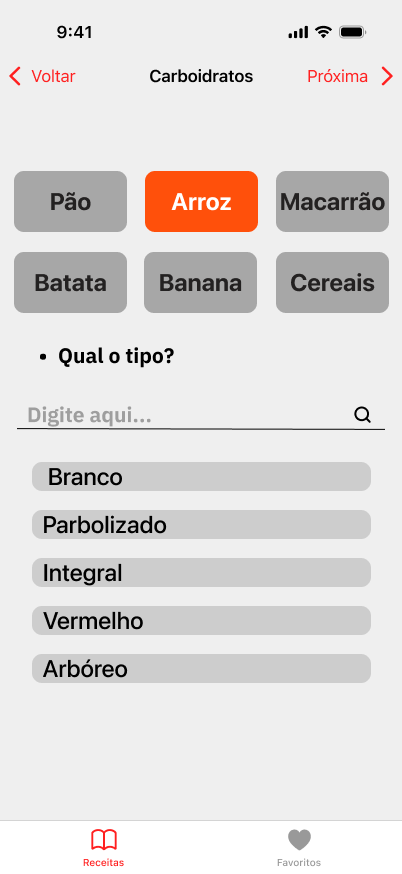
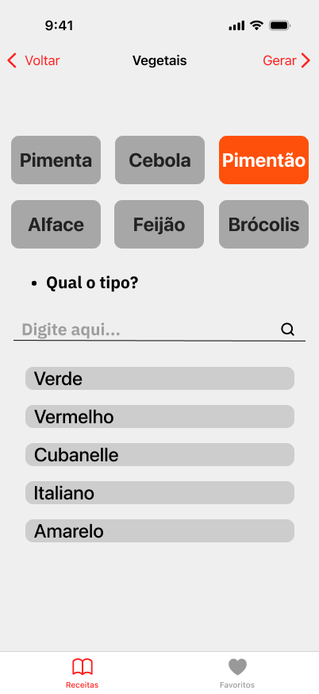
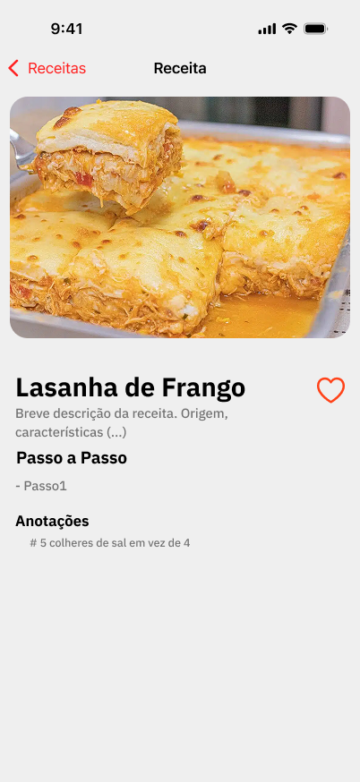
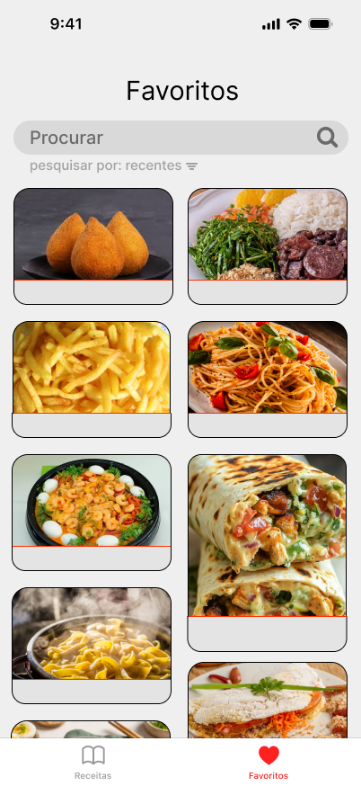
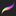

#### _Leia isso em outras linguaguens_
<kbd></kbd>

# Namassa App
  Namassa é um protótipo de aplicativo IOS desenvolvido por estudantes do Instituto Federal de Educação, Ciência e Tecnologia durante a turma Foundation do Apple Developer Academy.
O app se baseia na premissa de oferecer uma maneira prática de encontrar receitas com base na disponibilidade de ingredientes do usuário. Para tal, um mecanismo de busca por filtragem é disponibilizado, permitindo a busca de receitas condicionadas às escolhas do usuário.

   

# Principais funcionalidades :joystick:

## Fluxo de seleção dos ingredientes

Por meio desta funcionalidade, o usuário poderá definir, por categoria, os ingredientes que deverão compor as receitas pesquisadas. Em vista do principal objetivo do aplicativo, é usual que o usuário selecione os ingredientes que estejam, de alguma forma, acessíveis em seu ambiente de preparo.

  
  
  

## Receitas encontradas

Nessa tela, serão exibidas as receitas que, respeitando a seleção de ingredientes do usuário, forem encontradas.

  

## Visualização da receita
Nessa tela, o usuário poderá obter algumas informações a respeito de uma receita selecionada.

  

## Receitas favoritas
As receitas favoritadas aparecerão aqui

  

# Atalhos para nosso Github 🎯
- [Models](Namassa/Models)  
- [Views](Namassa/Views)  
- [Images](NamassaUtils)

# Integrantes 🌐

<table>
  <tbody>
    <tr>
      <td align="center"><a href="https://github.com/brwndag"> <b>Brenda Mônica</b>
        </a>
        
Designer
</td>
      <td align="center"><a href="https://github.com/IsaacMaf"> <b>Isaac Ramos</b></a>
        
Desginer
</td>
      <td align="center"><a href="https://github.com/LeviFaleh"> <b>Levi Faleh</b></a>
        
Developer
</td>
      <td align="center"><a href="https://github.com/VorAd2"> <b>Vitor Adriano</b></a>
        
Designer
</td>
    </tr>
  </tbody>
</table>

## Ferramentas usadas
|    |  |    |
|----|-------------------------|----|
|  Google         |  Xcode |  ChatGPT |
|  Github           |  SkecthBook |  Procreate |
|  Figma            |  YouTube |  WhatsApp |
